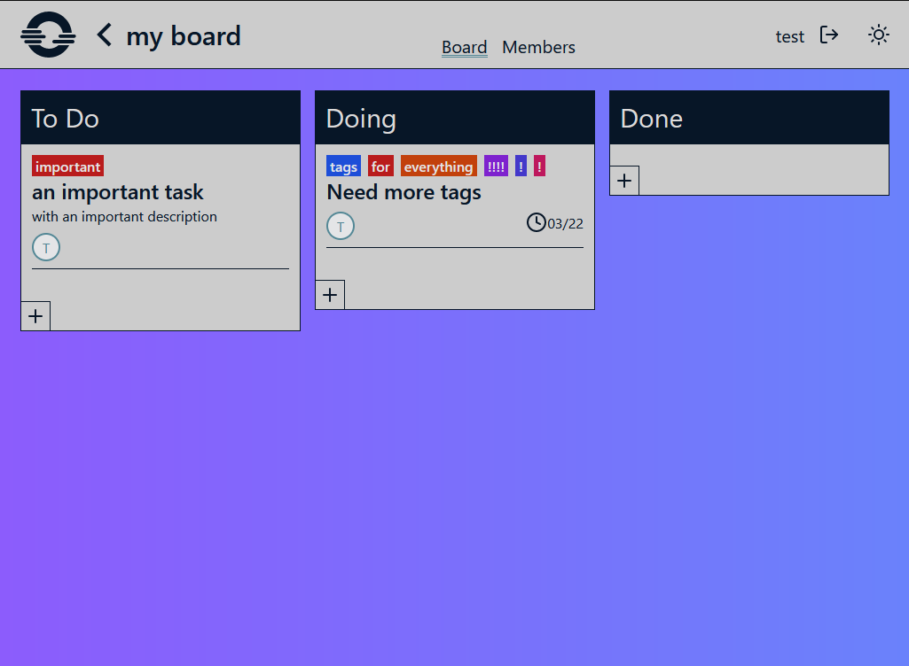
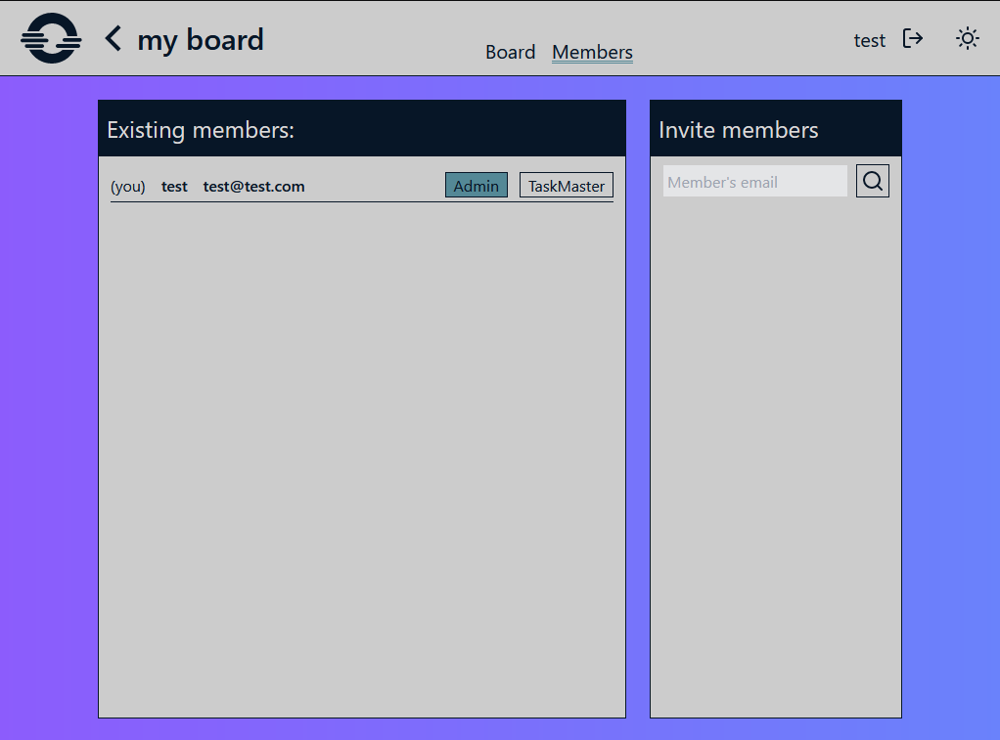

# TRESURE - minimal kanban board

- create multiple boards
- create cards with tags, assigned members and deadlines
- invite members and assign them roles
- see each other's edits instantly

# Screenshots

unfinished stuff:
- broken dates: moving a card reduces every date by 2 hours
- project report tab: tasks finished within some period, assigned, busy members, timeline (optional)
- accept project invitation
- moving tasks up and down
- expired cookies mess things up, 500 status code
- add cards in any place you want (spawn divs between cards)
- suggested tags, show a dropdown for existing tags
- keyboard shortcuts